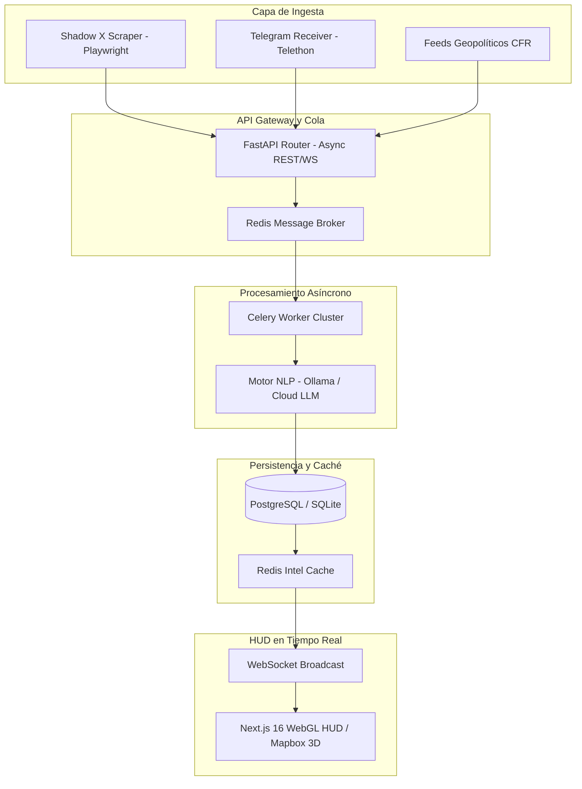

# 🛰️ World Heat Monitor (WHM) · Escaparate Público y Portafolio

> **Plataforma de Inteligencia Geopolítica OSINT en Tiempo Real**
> 
> *Un sistema distribuido robusto, seguro por diseño (Secure-by-Design) y de alto rendimiento que monitoriza, ingesta y analiza señales de amenazas geopolíticas de alta frecuencia utilizando IA agéntica, colas de procesamiento asíncronas y visualizaciones geoespaciales 3D.*

---

## 📺 Demostración Operativa y Vista HUD

> [!NOTE]
> *Este repositorio sirve únicamente como un escaparate arquitectónico público del sistema. El motor operativo principal y la lógica propietaria de scraping y procesamiento NLP se mantienen en un repositorio privado para proteger la propiedad intelectual (IP) comercial.*
> 
> 
> 
> **¿Deseas ver una demostración técnica en vivo?**  
> Además del video, estoy totalmente disponible para realizar una **demostración operativa en vivo** (vía Zoom/Teams con pantalla compartida) para analistas de riesgo, consultores de seguridad o socios tecnológicos interesados en evaluar la arquitectura en directo.
> 
> *(Escríbeme a jottasplive@gmail.com o contáctame por LinkedIn para agendar una breve sesión demostrativa de 10 minutos).*

---

## 🌌 Descripción General del Sistema

World Heat Monitor (WHM) es una plataforma táctica de monitorización geopolítica. Ingesta señales OSINT de alta frecuencia de múltiples vectores en tiempo real (X, Telegram, CFR, canales de rastreo militar), las procesa a través de una tubería asíncrona NLP para extraer inteligencia estructurada y las visualiza en un HUD táctico 3D. La capacidad de ingesta es alta; el throughput de procesamiento está acotado por la inferencia NLP (escala horizontalmente o sobre GPU dedicada).

### Capacidades Clave:
*   **Ingesta LIFO de Baja Latencia:** Procesamiento de colas LIFO (Last-In-First-Out) con derivación asíncrona para priorizar señales críticas. Latencia de ingesta acotada: señales de alta prioridad disponibles en el pipeline en **menos de 60 segundos** bajo carga normal.
*   **Arquitectura Segura por Diseño (Secure-by-Design):** Ciclo de vida de memoria de confianza cero (Zero Trust). Autenticación JWT estrictamente en memoria (sin uso de localStorage ni cookies persistentes) y endpoints administrativos completamente aislados.
*   **Análisis con IA Agéntica (Capa Cognitiva):** Inyección dinámica de contexto combinando perfiles estáticos de países y memoria dinámica de conflictos activos como mitigación estructural de alucinaciones del LLM. Genera incidentes en JSON estructurado validado por esquema Pydantic y narrativas duales. *(Sin evals de tasa de alucinación: las mitigaciones son arquitectónicas, no métricas.)*
*   **Mapeo 3D de Alta Fidelidad:** Cuadro de mando HUD de estética militar en Next.js 16 con renderizado geoespacial 3D personalizado con Mapbox GL, integrando líneas de guía, vectores de ataque y seguimiento de frentes activos.

---

## 🏗️ Arquitectura Técnica y Flujo de Datos

El sistema está diseñado con una arquitectura desacoplada basada en microservicios utilizando **FastAPI** como puerta de enlace (API Gateway), **Celery** para el procesamiento distribuido asíncrono en segundo plano, **Redis** como bróker de mensajería y caché de alto rendimiento, y **PostgreSQL/SQLite** para la persistencia de datos.

---

## 🛠️ Stack Tecnológico e Infraestructura

*   **Puerta de Enlace (Backend):** FastAPI (REST y WebSockets asíncronos), SQLAlchemy ORM, Alembic (Migraciones de Base de Datos).
*   **Procesamiento en Segundo Plano:** Colas de tareas Celery, Redis (Bróker y Caché), Programador de Tareas (APScheduler).
*   **Protocolos de Ingesta:** Playwright (Scraper furtivo con rotación de sesiones), Telethon (receptor asíncrono de Telegram en tiempo real).
*   **Motor Cognitivo (NLP):** Cliente LLM agnóstico del proveedor (Ollama/Gemma para entornos seguros sin conexión local; DeepSeek/GPT-4o-mini para escalado en la nube), parser JSON basado en esquemas Pydantic.
*   **Interfaz de Usuario:** Next.js 16 (App Router), Tailwind CSS v4, Mapbox GL (Renderizado WebGL 3D personalizado sin librerías de interfaz externas pesadas).
*   **DevOps y Seguridad:** Docker, orquestación de contenedores mediante archivos YAML, GitHub Actions, segregación estricta de entornos (Desarrollo/Producción).

---

## 🔒 Ingeniería de Rendimiento y Seguridad

1.  **Protección de Tokens JWT:** Para mitigar vulnerabilidades de scripting entre sitios (XSS), los tokens de acceso JWT se mantienen estrictamente en la memoria del cliente y nunca se guardan en localStorage ni en cookies de navegador.
2.  **Purga de Latencia LIFO:** Los picos masivos de señales OSINT se procesan en orden LIFO. Las señales obsoletas (>10 minutos) se mueven automáticamente a un historial frío, preservando los recursos de CPU en caliente para eventos en tiempo real inmediato.
3.  **Aislamiento Local de IA (Ollama):** Para despliegues que exigen confidencialidad absoluta (evitando el envío de datos internos a empresas externas de IA), WHM puede operar de forma 100% desconectada utilizando instancias locales de Ollama, securizando el perímetro de datos corporativos.

---

## 📬 Contacto y Soporte Comercial

Si eres una empresa de análisis de riesgos, consultoría de seguridad o socio tecnológico interesado en una **demostración operativa en vivo** (vía pantalla compartida) de World Heat Monitor para valorar su integración comercial, puedes ponerte en contacto a través de:

*   **Contacto:** Juan Pedro R.F.
*   **Rol:** Lead Architect & Security Officer (WHM Project)
*   **Email:** [jottasplive@gmail.com](mailto:jottasplive@gmail.com)
*   **LinkedIn:** [linkedin.com/in/juan-pedro-r-f-313954241/](https://www.linkedin.com/in/juan-pedro-r-f-313954241/)

---

> [!NOTE]
> **Estado técnico honesto:** El sistema está operativo end-to-end en entorno de desarrollo (ingesta → procesamiento NLP → visualización 3D). Las áreas pendientes para un despliegue de producción con SLA son: observabilidad estructurada (trazas distribuidas), tests de carga y alta disponibilidad. Saber qué falta es parte del diseño.
